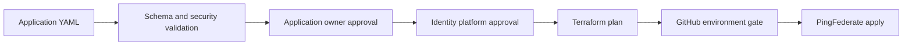

# PingFederate OAuth2 Deployment

Declarative, reviewed deployment of PingFederate OAuth2 clients and shared
OAuth platform configuration using YAML, Terraform, and GitHub Actions.

Application teams define one file named
`oauth2_<organisation>_<application>.yaml`. The service validates that file,
enforces ownership and approval rules, creates a Terraform plan, and deploys
the configuration through protected environments.

## What this repository manages

- OAuth2 clients and environment-specific redirect URIs
- Single-instance promotion using automatic `dev-`, `stg-`, and `prod-`
  client-ID prefixes
- Access token managers and access token mappings
- OpenID Connect policies
- Token exchange processor policies and generator mappings
- Application ownership and CODEOWNERS rules
- Per-application Terraform state, planning, deployment, import, rotation,
  retirement, and drift detection

Token processors and generators are referenced through an allowlisted
platform catalog rather than created by application configuration.

## Repository layout

| Path | Purpose |
| --- | --- |
| `oauth2/applications/` | Deployable application definitions |
| `oauth2/platform/` | Identity-owned shared PingFederate catalog |
| `oauth2/schemas/` | JSON Schemas for editor and CI validation |
| `oauth2/examples/` | Non-deployable client examples |
| `oauth2/ownership.yaml` | Application and identity team ownership |
| `oauth2/tools/` | Validation, rendering, review, and CI tooling |
| `terraform/modules/` | PingFederate application and platform modules |
| `terraform/stacks/` | Independently stateful Terraform roots |
| `.github/workflows/` | Validation and deployment automation |
| `setup/` | AWS and Vault bootstrap Terraform |
| `setup/arc-runner/` | ARC runner image and Helm values example |

## Quick start

Install the pinned Python dependencies:

```bash
python -m pip install -r oauth2/tools/requirements.txt
```

Register the application owner in `oauth2/ownership.yaml`:

```yaml
identityPlatformTeam: your-org/identity-platform
applications:
  example/example-app:
    githubTeam: your-org/example-app-owners
```

Generate a disabled client definition:

```bash
python oauth2/tools/oauth2_config.py scaffold \
  --organisation example \
  --application example-app \
  --profile confidential_web \
  --name "Example application"
```

The generated path is:

```text
oauth2/applications/oauth2_example_example-app.yaml
```

Complete its environment settings, then validate the repository and update
CODEOWNERS:

```bash
python oauth2/tools/oauth2_config.py validate
python oauth2/tools/oauth2_config.py codeowners
```

Commit both the application file and generated `.github/CODEOWNERS` change.

See [`oauth2/examples/oauth2_example_example-app.yaml`](oauth2/examples/oauth2_example_example-app.yaml)
for a complete non-deployable example and [`oauth2/README.md`](oauth2/README.md)
for the detailed author and operator guide.

## Deployment flow



Branches map to environments as follows:

| Branch | Environment |
| --- | --- |
| `develop` | `development` |
| `staging` | `staging` |
| `production` | `production` |

Promotion is restricted to `develop` → `staging` → `production`. Shared
platform configuration is applied before affected applications. Each
application has isolated state and application deployments are concurrency
limited.

## Security controls

The configuration contract rejects duplicate YAML keys, unknown properties,
inline secrets, insecure or wildcard redirects, unknown scopes, and invalid
platform references. OAuth profiles constrain grants and authentication:

- Browser and native clients require PKCE.
- Implicit and resource-owner-password grants cannot be configured.
- Confidential client secrets are generated once by trusted deployments and
  subsequently read from Vault; ordinary deployment cannot overwrite them.
- PingFederate root and intermediate CA certificates are retrieved from Vault
  PKI and trusted explicitly for each deployment job.
- Pull requests require approvals from the application owner and a different
  identity-platform team member at the current commit.
- GitHub Actions dependencies are pinned to commit SHAs.
- AWS and Vault authentication use GitHub OIDC rather than stored cloud
  credentials.
- Terraform state and saved plans use private, versioned, SSE-KMS encrypted
  S3 storage.
- Saved plans are protected by SHA-256 checksums.
- A client must be deployed as disabled for at least 24 hours before removal.
- Scheduled drift detection plans changes but never applies them.

## Repository configuration

Provision the shared AWS and Vault prerequisites first. See
[`setup/README.md`](setup/README.md) for the bootstrap procedure and generated
GitHub variable values.

Create protected `develop`, `staging`, and `production` branches and GitHub
Environments for `development`, `staging`, and `production`. Configure
required reviewers for sensitive environments.

Required repository variables:

| Variable | Purpose |
| --- | --- |
| `OAUTH2_AWS_REGION` | Terraform state bucket region |
| `OAUTH2_TF_STATE_BUCKET` | Private, versioned state and plan bucket |
| `OAUTH2_TF_STATE_KMS_KEY_ID` | Customer-managed KMS key ARN |
| `OAUTH2_AWS_ROLE_ARNS` | JSON environment-to-AWS-role mapping |
| `OAUTH2_VAULT_ADDR` | Internal Vault HTTPS address |
| `OAUTH2_VAULT_ROLES` | JSON environment-to-Vault-role mapping |
| `OAUTH2_PF_HOSTS` | JSON environment-to-PingFederate-host mapping |
| `OAUTH2_PF_INSECURE_TRUST_ALL_TLS` | Temporary TLS certificate verification bypass |
| `OAUTH2_REVIEW_APP_ID` | Least-privilege GitHub App ID |

Required repository secret:

| Secret | Purpose |
| --- | --- |
| `OAUTH2_REVIEW_APP_PRIVATE_KEY` | GitHub App private key for approval checks |

The GitHub App requires pull-request read access and organisation
team-membership read access.

## Runner and secret requirements

All workflows use the Actions Runner Controller scale set named
`arc-runner-set`. Its runner image must:

- Reach the PingFederate Admin API and Vault over trusted TLS.
- Provide `aws`, `curl`, `jq`, `python3`, `terraform`, and `vault`.
- Use repository-, branch-, and environment-restricted AWS and Vault OIDC
  roles.

Store the dedicated PingFederate Terraform administrator credentials at:

```text
kv/pingfederate/<environment>/terraform-admin
```

using `username` and `password` keys. Confidential application secrets use:

```text
kv/oauth2/<environment>/<organisation>/<application>#client_secret
```

## Workflows

| Workflow | Purpose |
| --- | --- |
| `oauth2-validate` | Schema, semantic, ownership, Python, and Terraform checks |
| `oauth2-review-gate` | Dual-team, current-commit approval enforcement |
| `oauth2-pr-plan` | Trusted Terraform plan for an approved pull request |
| `oauth2-deploy` | Branch-driven platform and application deployment |
| `oauth2-promotion-check` | Branch promotion policy |
| `oauth2-scaffold` | Generate a correctly named disabled client file |
| `oauth2-drift` | Scheduled non-applying drift detection |
| `oauth2-import` | Controlled adoption of an existing OAuth client |
| `oauth2-rotate` | Apply a client secret rotation after Vault is updated |

## Local verification

```bash
python oauth2/tools/oauth2_config.py validate
python oauth2/tools/oauth2_config.py codeowners --check
python -m unittest discover -s oauth2/tests -v
terraform fmt -check -recursive terraform
bash -n oauth2/tools/terraform_ci.sh
```

Terraform and provider versions are pinned in the stack files and dependency
lock files. Do not manually edit generated CODEOWNERS entries or commit
Terraform state, plans, credentials, or rendered secrets.
