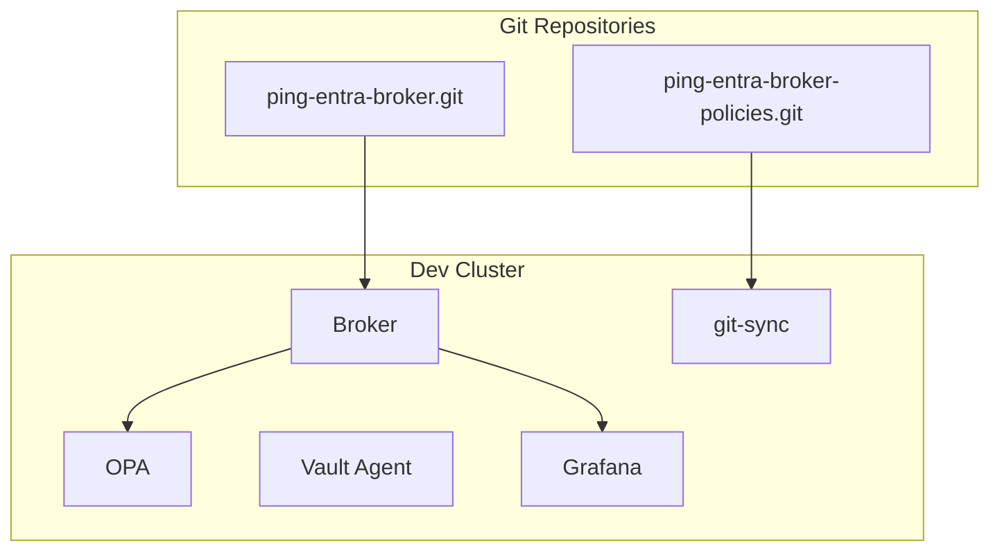

# Ping → Entra Identity Broker Platform

<p align="center">
  
  
  
  
  
  
</p>

## Architecture Overview



## PingFederate OAuth2 configuration as code

OAuth2 clients and shared PingFederate policies can be deployed from reviewed
YAML through Terraform and protected GitHub Actions. The service includes JSON
Schema validation, secure client profiles, deterministic ownership, dual-team
approvals, per-application state, Vault secret references, environment
promotion, drift detection, imports, rotation, and a 24-hour
disable-before-destroy gate.

See [oauth2/README.md](oauth2/README.md) for authoring and operator setup.

## Deploying Argo CD via Helm

Prereqs: `helm` installed and kube context set to the target cluster.

```bash
# Add repo and update indices
helm repo add argo https://argoproj.github.io/argo-helm
helm repo update

# Create namespace
kubectl create namespace argocd --dry-run=client -o yaml | kubectl apply -f -

# Install/upgrade Argo CD with ingress + OIDC (edit values first)
helm upgrade --install argocd argo/argo-cd \
  --namespace argocd \
  -f deploy/argocd/values.yaml

# (Optional) wait for controller and server
kubectl rollout status deploy/argocd-server -n argocd
kubectl rollout status deploy/argocd-repo-server -n argocd

kubectl -n argocd get secret argocd-initial-admin-secret -o jsonpath="{.data.password}" | base64 -d
```

After install, fetch the initial admin password:

```bash
kubectl get secret argocd-initial-admin-secret -n argocd -o jsonpath="{.data.password}" | base64 -d; echo
```

Argo CD ingress/OIDC configuration lives in [deploy/argocd/values.yaml](deploy/argocd/values.yaml#L1-L25). Update the OIDC issuer/client values and ensure DNS `argocd.darkedges.au` points to the Kong LoadBalancer. TLS is issued via cert-manager using the `letsencrypt-prod` ClusterIssuer.

## Deploy the Full Stack (Broker + OPA/Vault + Grafana/Prometheus)

1) Bootstrap Argo CD (see section above) and add repo access if private.
2) Apply the Argo CD Applications for your environment:

```bash
# choose one env (dev|stage|prod)
kubectl apply -f deploy/argocd-broker-dev.yaml -n argocd
kubectl apply -f deploy/argocd-grafana.yaml -n argocd
kubectl apply -f deploy/argocd-prometheus.yaml -n argocd
kubectl apply -f deploy/argocd-vault.yaml -n argocd
```

1) Let Argo CD sync; it will deploy:

- Broker workload plus sidecars and configs (includes OPA sidecar and Vault Agent templates) from [deploy/broker/overlays/*](deploy/broker/overlays/dev/kustomization.yaml).
- Prometheus via Argo CD Helm app [deploy/argocd-prometheus.yaml](deploy/argocd-prometheus.yaml) (kube-prometheus-stack).
  - Node exporter hostRootFsMount is disabled to avoid mountPropagation issues on this runtime. Enable if your cluster supports host rootfs mounts.
- Grafana (single shared instance) from [deploy/argocd-grafana.yaml](deploy/argocd-grafana.yaml).
  - Ingress: grafana.darkedges.au via Kong with TLS (letsencrypt-prod). OIDC placeholders in [deploy/grafana/base/values.yaml](deploy/grafana/base/values.yaml#L17-L44) must be set (issuer/client id/secret). Create the secret [deploy/grafana/base/secret-grafana-oidc.yaml](deploy/grafana/base/secret-grafana-oidc.yaml) with the client secret before syncing.
  - Prometheus datasource is preconfigured to `kube-prometheus-stack-prometheus.observability.svc:9090`. Adjust if your Prometheus service differs.
- Create secret [deploy/grafana/base/secret-grafana-oidc.yaml](deploy/grafana/base/secret-grafana-oidc.yaml) with `GF_AUTH_GENERIC_OAUTH_CLIENT_SECRET` before syncing Grafana (chart blocks inline secrets).
- Vault via Helm chart managed by Argo CD with ingress `vault.darkedges.au` from [deploy/argocd-vault.yaml](deploy/argocd-vault.yaml).

1) Prometheus (option if not already present):

```bash
helm repo add prometheus-community https://prometheus-community.github.io/helm-charts
helm repo update
kubectl create namespace observability --dry-run=client -o yaml | kubectl apply -f -
helm upgrade --install kube-prometheus prometheus-community/kube-prometheus-stack \
  --namespace observability \
  --version 65.2.0
```

1) Validate rollouts:

```bash
kubectl get pods -n ping-entra-dev
kubectl get pods -n observability-dev
```

1) Access Grafana:

```bash
kubectl port-forward svc/broker-grafana -n observability-dev 3000:80
```

Notes:

- Adjust env (dev/stage/prod) and namespaces accordingly.
- Git-sync now pulls policies from <https://github.com/darkedges/ping-entra-broker-policies.git> using dev/stage/prod branches.
- Update `repoURL`/`targetRevision` in Argo CD Application manifests if your remote/branch differs.

## Ingress with Kong, cert-manager, and Let's Encrypt

Install cert-manager (for ACME certificates):

```bash
kubectl create namespace cert-manager --dry-run=client -o yaml | kubectl apply -f -
helm repo add jetstack https://charts.jetstack.io
helm repo update
helm upgrade --install cert-manager jetstack/cert-manager \
  --namespace cert-manager \
  --version v1.14.4 \
  --set installCRDs=true
```

Configure a ClusterIssuer for Let's Encrypt (HTTP-01 via Kong):

```yaml
apiVersion: cert-manager.io/v1
kind: ClusterIssuer
metadata:
  name: letsencrypt-prod
spec:
  acme:
    email: you@example.com
    server: https://acme-v02.api.letsencrypt.org/directory
    privateKeySecretRef:
      name: letsencrypt-prod
    solvers:
      - http01:
          ingress:
            class: kong
```

Apply the issuer:

```bash
kubectl apply -f clusterissuer-letsencrypt-prod.yaml
```

Install Kong Ingress Controller:

```bash
kubectl create namespace kong --dry-run=client -o yaml | kubectl apply -f -
helm repo add kong https://charts.konghq.com
helm repo update
helm upgrade --install kong kong/ingress \
  --namespace kong \
  --set ingressController.installCRDs=true \
  --set proxy.type=LoadBalancer
```

Expose the broker via Kong (example):

```yaml
apiVersion: networking.k8s.io/v1
kind: Ingress
metadata:
  name: broker
  namespace: ping-entra-dev
  annotations:
    kubernetes.io/ingress.class: kong
    cert-manager.io/cluster-issuer: letsencrypt-prod
spec:
  tls:
    - hosts: [broker.dev.example.com]
      secretName: broker-tls
  rules:
    - host: broker.dev.example.com
      http:
        paths:
          - path: /
            pathType: Prefix
            backend:
              service:
                name: broker
                port:
                  number: 80
```

Apply the ingress per environment with your hostnames and namespaces:

```bash
kubectl apply -f ingress-broker-dev.yaml
```

Notes:
- Update the ACME email, hostnames, and namespaces for each environment (dev/stage/prod).
- Ensure the Kong proxy LoadBalancer address or DNS is reachable for HTTP-01 challenges.
